# 程序设计实践实践作业报告

---

## 1. 作业要求及内容

1. 程序题目：一个规范的软件原型系统
2. 描述：软件原型系统是验证技术可行性的一类重要的应用软件，在新产品研发和科研活动中被广泛应用。它是介于软件单一技术作业和软件产品之间的一种软件形态，对于综合利用程序设计单项技能提出了较高要求。通过本作业，考察学生规范编写代码、合理设计程序、灵活应用技术、协同组织合作等方面的综合能力。
3. 要求
   - 基本功能要求：（60分）
      - 针对一个主题（如：课程表、选课、备忘录、点餐等），在模拟器或物理设备上，实现一个具有实用价值的本地功能软件。
      - 保证变量名命名、方法命令、类命名、代码块分割、注释等方面满足课堂上讲授的编码风格要求。（40分）
      - 包含程序设计文档，说明程序的主要功能、结构，如果使用了特定的算法，需要对给出算法的伪代码描述。（10分）
      - 包含程序测试文档，说明测试环境、测试方法、测试工具、测试例和测试结果。（10分）
   - 界面要求（10分）
      - 所实现的程序满足课堂讲授的界面要求。具备良好的模块接口，使模块能够在其他项目中较为容易的复用（10分）。
      - 具备良好的人机交互界面，操作方式符合用户直觉，与主流程序的操作方式一致。图形界面需满足界面简洁、元素反差对照、空白分割、平衡恰当、元素对齐等要求。（10分）
   - 并发计算要求（10分）
      - 所实现的程序使用多进程/多线程等并发计算技术完成某项实际功能（例如：多用户同时在线操作或数据异步更新等）。
   - 健壮性要求（10分）
      - 所实现的程序在用户输入错误数据、网络连接中断、鼠标随意点击拖拽等异常情况下 出现异常退出、挂起、输出内部错误信息等情况，能够提供用户易于理解和接受的反应。
   - 扩展性要求（10分）
      - 实现的程序正确的应用了设计模式，合理的使用了并发、持久化、资源池等技术，架构合理，为未来功能和性能的扩展做了相应准备。

## 2. 程序功能

程序实现了一个备忘录软件，带有客户端和服务端。

- 功能：
  - 客户端：
    - 可以添加备忘，每条备忘的长度不超过200字。
    - 可以编辑备忘，在备忘展开后转换为可供编辑的状态。
    - 可以标记备忘，表示备忘事项已完成。
    - 可以删除已完成的备忘，或者一次性删除全部的备忘。
    - 可以将本地的备忘上传至服务端，以实现备忘在不同设备间的传递。
    - 可以将服务端的备忘下载至本地，以实现备忘的同步。
    - 提供账户登录功能，以便使用同步功能。
  - 服务端
    - 为客户端提供服务，存储不同账户的备忘，并在客户端需要时提供已上传的备忘。

## 3. 程序设计

### 3.1. 客户端

客户端使用`QML`+`C++`编写，其中`QML`用于描述UI和部分业务逻辑，`C++`负责数据库的访问管理以及与服务端的网络传输，并提供接口给`QML`使用。

程序使用到的库:

- [Qt(5.12)](https://www.qt.io/)

#### 3.1.1 程序结构

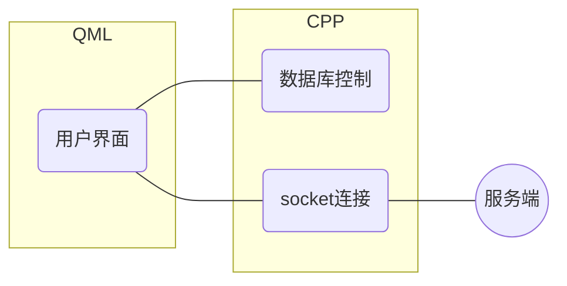

#### 3.1.2. 用户界面

如下图所示，分为两部分
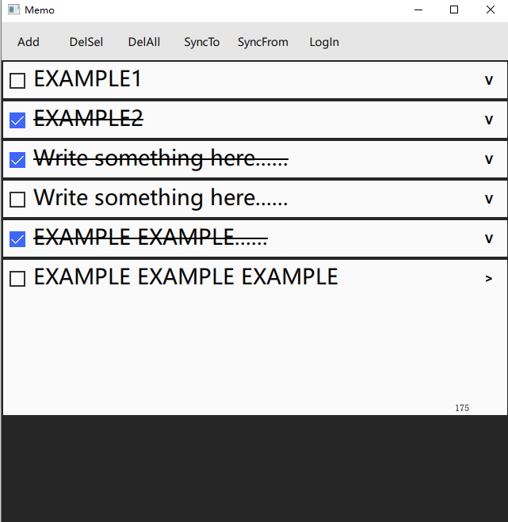

- 工具栏
  
  - 点击`Add`按钮，可以添加一条记录至数据库并显示。
  - 点击`DelSel`按钮，可以去除所有已完成的备忘，同时从数据库中去除那些备忘。
  - 点击`DelAll`按钮，可以去除所有备忘，同时从数据库中去除所有备忘。
  - 点击`SyncTo`按钮，可以上传备忘至服务端。
  - 点击`SyncFrom`按钮，可以下载备忘至本地。
  - 点击`LogIn`按钮，可以登录或注册账户。
    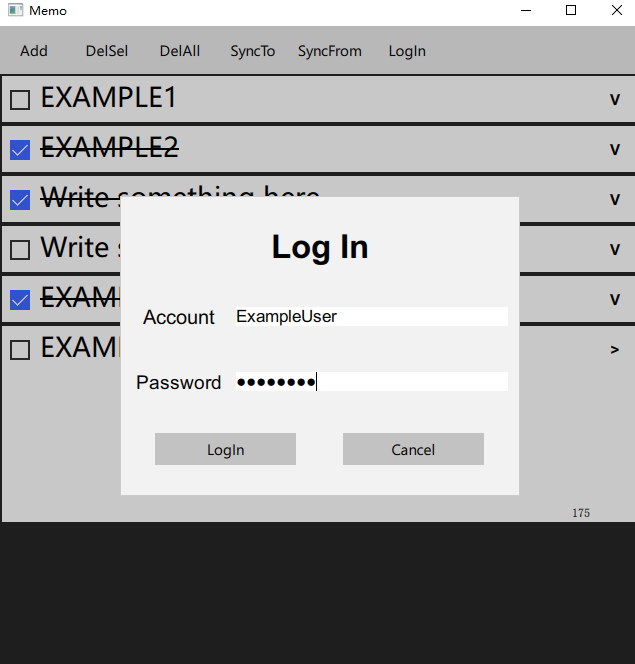
    - 模态界面。
    - `Account`标签后可输入账户ID，输入框带有文本过滤。
    - `Password`标签后可输入账户密码，输入框带有文本过滤及密码隐藏。
    - 点击`LogIn`按钮，检查输入栏内容，调用`C++`接口连接服务端。
    - 点击`Cancel`按钮，退出此窗口。
- 备忘界面
  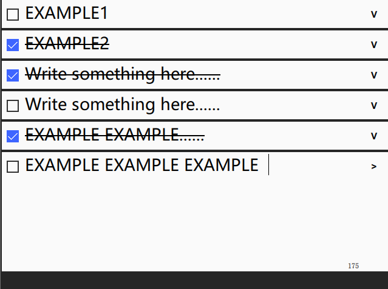
  - 点击左侧选框，可以标记备忘已完成。
  - 点击右侧按钮（箭头）可以展开备忘以供查看或编辑。
  - 展开后的备忘右下角显示当前还可输入的字符数量。

#### 3.1.3. 数据库管理

##### 3.1.3.1. 数据库

使用`Qt`提供的`sqlite`数据库。

下为表结构：

```sql
CREATE TABLE IF NOT EXISTS user(
    id          NVARCHAR(36) NOT NULL DEFAULT "");

CREATE TABLE IF NOT EXISTS records(
    record_id   INT PRIMARY KEY NOT NULL,
    record_text NVARCHAR(240) DEFAULT "",
    is_done     BOOLEAN NOT NULL DEFAULT false);
```

定义了`user`表和`records`表，`user`表用于存储当前登录的用户，`records`表用于存储备忘记录，`record_id`为记录的编号，该编号总是由 1 开始递增到最后一条记录。

##### 3.1.3.2. 私有成员

```c++
bool _is_inited
QSqlDatabase _db_con
int _max_id

int getUserSize()
bool deleteUser()
bool setAttr(const int rec_id, QString attr_name, QVariant val)
QVariant getAttr(const int rec_id, QString attr_name)
int getRecSize()
```

- `_is_inited`：存储初始化结果，供调用者判断程序是否正确初始化，以决定程序是否继续运行。
- `_db_con`：数据库连接，用于访问数据库。
- `_max_id`：记录当前记录的最大ID号。
- `int getUserSize()`：获取当前`user`表的大小，用于判断是否应该清除表（析构时）。
- `bool deleteUser()`：清除`user`表，返回清除是否成功。
- `bool setAttr(const int rec_id, QString attr_name, QVariant val)`：设定记录编号为`rec_id`的记录的属性`attr_name`的值为`val`。
- `QVariant getAttr(const int rec_id, QString attr_name)`：获取记录编号为`rec_id`的记录的属性`attr_name`的值。
- `int getRecSize()`：获取`records`表的大小，

##### 3.1.3.3. 接口

公有接口：

```c++
public:
bool isInit()
```

- `bool isInit() const`：用于获取实例初始化结果，如果初始化失败，则退出程序。

槽函数，供`QML`访问：

```c++
public slots:
bool addRecord(const QString &due_date, const QString &rec_text);
bool setIsDone(const int rec_id,const bool is_done)
bool setText(const int rec_id, const QString &text)
QString getDueDate(const int rec_id)
bool getIsDone(const int rec_id)
QString getText(const int rec_id)
bool removeRecord(const int rec_id)
bool setID(const QString &id)
int getMaxId()
QString getId()
```

- `bool addRecord(const QString &due_date, const QString &rec_text)`：添加一条记录，自动安排记录编号。
- `bool setIsDone(const int rec_id,const bool is_done)`
- `bool setText(const int rec_id, const QString &text)`：调用`setAttr`来设定相应属性的值。
- `bool setID(const QString &id)`：设定当前用户的ID。
- `bool getIsDone(const int rec_id)`
- `QString getText(const int rec_id)`：调用`getAttr`来获取相应属性的值。
- `bool removeRecord(const int rec_id)`：移除给定记录，并自动更新编号。
- `int getMaxId()`：获取当前最大记录编号。

##### 3.1.3.4. 初始化

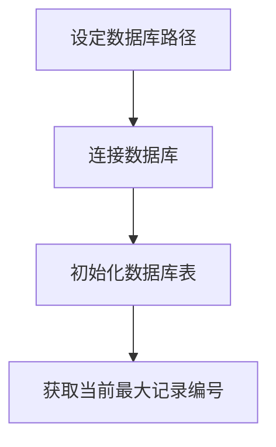

#### 3.1.4. 网络连接

##### 3.1.4.1 简介

封装了`QTcpSocket`，实现了阻塞连接，并且暴露类至`QML`。

##### 3.1.4.2 私有成员

```c++
QTcpSocket *_socket = nullptr;
QAbstractSocket::SocketState _state = QAbstractSocket::UnconnectedState;
QString _host;
unsigned _port;
int _timeout_ms = 30000;
```

- `QTcpSocket *_socket`：用于连接服务端。
- `QAbstractSocket::SocketState _state`：暴露至`QML`以供其获取socket状态。
- `QString _host;`：暴露至`QML`，供其设置服务端域名。
- `unsigned _port;`：暴露至`QML`，供其设置服务端端口号。
- `int _timeout_ms`：超时时长。

下为暴露至`QML`的属性：

```c++
Q_PROPERTY(QString host READ getHost WRITE setHost NOTIFY hostChanged)
Q_PROPERTY(unsigned port READ getPort WRITE setPort NOTIFY portChanged)
Q_PROPERTY(QAbstractSocket::SocketState state READ getState WRITE setState NOTIFY stateChanged)
```

表示了每种属性进行何种操作时应当调用哪个方法与`C++`通信。

- `READ`表示读取时通过给定方法获取属性值。
- `WRITE`表示更改时通过给定方法修改属性值。
- `NOTIFY`表示属性更改时发出的信号(`signal`)。

##### 3.1.4.3. 接口

公有接口：

```c++
public:
QString getHost()
void setHost(const QString &host)
unsigned getPort()
void setPort(const unsigned port)
QAbstractSocket::SocketState getState()
void setState(QAbstractSocket::SocketState state)
```

槽函数：

```c++
public slots:
bool connect()
void write(const QString &msg)
void setTimeOut(const int timeout_ms)
void disconnect()
```

- `bool connect()`：连接至`host:port`，阻塞，返回连接的结果。
- `void write(const QString &msg)`：向服务端传输`msg`，编码为`base64`以传输非ascii字符。
- `void setTimeOut(const int timeout_ms)`：设定超时时间。
- `void disconnect()`：断开连接，在程序终止时使用。

##### 3.1.4.4. 初始化

```c++
TcpSocket(QObject *parent = nullptr) : QObject(parent)
    {
        _socket = new QTcpSocket(this);

        QObject::connect(_socket, &QAbstractSocket::stateChanged,
                [=](QAbstractSocket::SocketState state)
                {
                    setProperty("state", state);
                });

        QObject::connect(_socket, &QAbstractSocket::readyRead,
                [=]()
                {
                     emit read(QString::fromUtf8(QByteArray().fromBase64(_socket->readAll())));
                });

        QObject::connect(_socket, &QAbstractSocket::connected,
                [=]()
                {
                    emit connected();
                });

        QObject::connect(_socket, &QAbstractSocket::disconnected,
                [=]()
                {
                     emit disconnected();
                });
    }
```

首先初始化`_socket`，之后设定`_socket`状态发生转换时所发送的信号。

如下图所示：

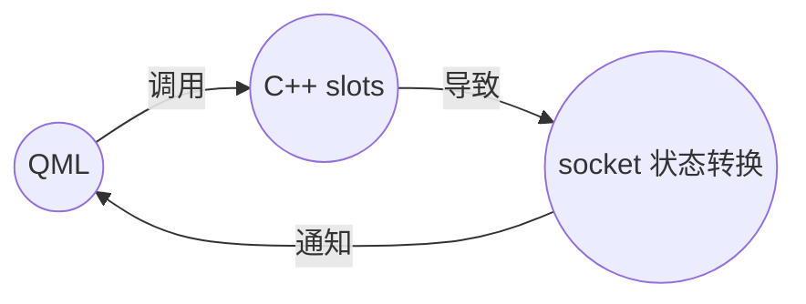

##### 3.1.4.5. 与服务端的连接

见服务端文档有关内容。

### 3.2. 服务端

服务端包括以下特性：

- 由不同组件组合构成，组件间以消息队列传递消息进行通信。
- 多线程并发的异步网络处理(`Boost.asio`)。
- 客户端与服务端的通信采用以`base64`编码的`JSON`字符串。
- 信号量实现的消息队列。
- 控制器接受网络组件的消息，将消息分配至负责处理此类消息的组件。
- 资源池组件，接受控制器传来的消息，进一步调度（Round-Robin）至其子组件。
- 用户管理组件以及备忘存储管理组件，由资源池管理，每个组件一个线程。
- 使用数据库（MySql）存储数据。
- 支持并发分级别的无缓冲日志。
- 组件通过提供其消息队列指针注册至控制器以供其调度。

服务端使用了以下库:

- [Boost(1.72.0)](https://www.boost.org/)
- [Qt(5.12)](https://www.qt.io/)
- [rapidjson](https://rapidjson.org/)
- [PicoSHA2](https://github.com/okdshin/PicoSHA2)
- [cpp-base64](https://github.com/ReneNyffenegger/cpp-base64)

#### 3.2.1. 程序结构

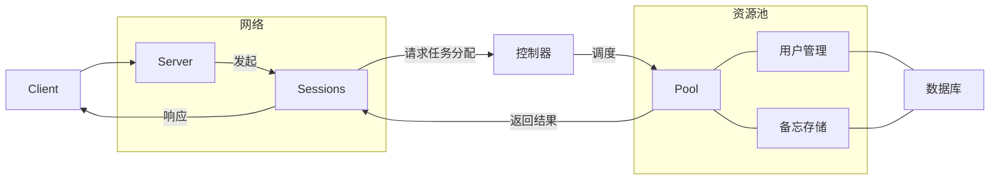

#### 3.2.2. 消息队列

所实现的消息队列是带由信号量提供线程安全机制的队列，首先是信号量的实现。

```c++
class Semaphore
{
public:
    Semaphore(unsigned long count = 0) : _count(count)
    {
    }

    Semaphore(const Semaphore &) = delete;
    Semaphore &operator=(const Semaphore &) = delete;

    void Signal()
    {
        std::unique_lock<std::mutex> lock(_mtx);
        _count++;
        _cv.notify_one();
    }

    void Wait()
    {
        std::unique_lock<std::mutex> lock(_mtx);
        while (_count == 0)
        {
            _cv.wait(lock);
        }
        _count--;
    }

private:
    unsigned long _count;
    std::mutex _mtx;
    std::condition_variable _cv;
};
```

通过条件变量以进行非阻塞的等待，在每次调用`Signal`时，都会唤醒处于`Wait`的线程，避免循环检测`_count`导致的性能开销。

接着使用信号量实现消息队列：

```c++
template <typename T>
class JobQueue
{
public:
    JobQueue() : _jobs(), _semaphore() {}
    void Push(const T &job)
    {
        {
            std::lock_guard<std::mutex> lock(_mtx);
            _jobs.push_back(job);
        }
        _semaphore.Signal();
    }

    T Pop()
    {
        T res;
        _semaphore.Wait();
        {
            std::lock_guard<std::mutex> lock(_mtx);
            res = _jobs.front();
            _jobs.pop_front();
        }
        return res;
    }

    JobQueue *GetReg() noexcept
    {
        return this;
    }

private:
    std::deque<T> _jobs;
    Semaphore _semaphore;
    std::mutex _mtx;
};
```

每当线程需要改变（`Push`，`Pop`）时，都必须先获取锁以访问队列，之后通过信号量在线程间传递队列中元素的数量，同时通过`GetReg`以便组件获取其指针。

#### 3.2.3. 组件

每一个组件都必须满足以下要求:

- 提供其消息队列的指针或引用，使得控制器可以对其进行调度。
- 有消息队列。

如此由抽象类所定义:

```c++
template <typename QueueType>
class AbstractComponent
{
public:
    virtual QueueType *GetHandle() = 0;
};
```

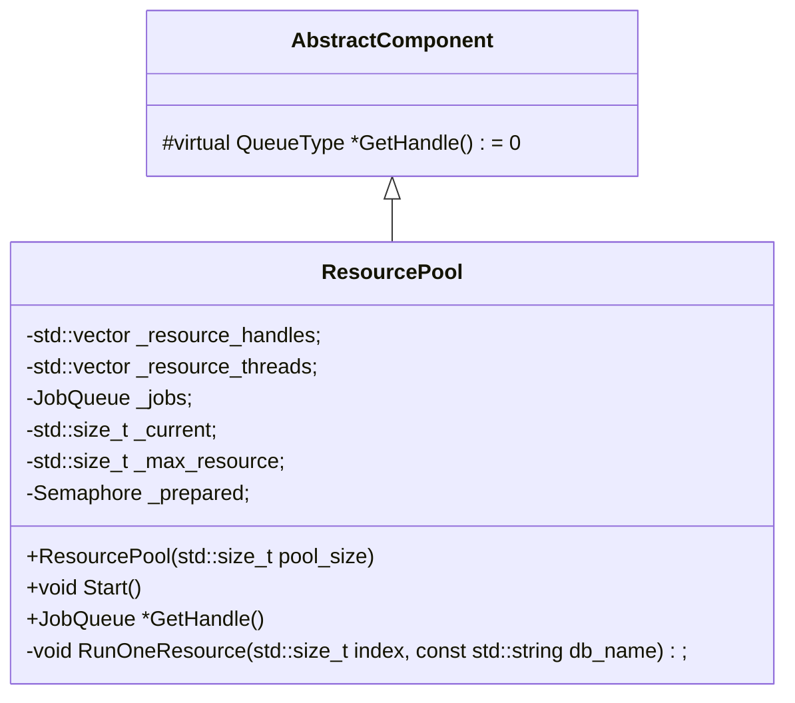

不对其消息队列类型进行限制，可以自由定义，但是必须提供访问的方法。

##### 3.2.3.1. 资源池

资源池由抽象类`AbstractComponent`继承而来：

```c++
template <typename ResourceType>
class ResourcePool : public AbstractComponent<JobQueue<RegPointer>>
```

`ResourceType`指定了资源的类型。

其定义如下

```c++
template <typename ResourceType>
class ResourcePool : public AbstractComponent<JobQueue<RegPointer>>
{
public:
    ResourcePool(std::size_t pool_size = 4);

    void Start();
    JobQueue<RegPointer> *GetHandle() override { return &_jobs; }

private:
    std::vector<JobQueue<RegPointer> *> _resource_handles;
    std::vector<std::thread> _resource_threads;
    JobQueue<RegPointer> _jobs;
    std::size_t _current;
    std::size_t _max_resource;
    Semaphore _prepared;

    void RunOneResource(std::size_t index, const std::string db_name);
};
```

- `std::vector<JobQueue<RegPointer> *> _resource_handles`：用于存放其资源组件消息队列的指针，以传递消息。
- `std::vector<std::thread> _resource_threads`：存放其资源组件的线程，用于为其资源组件申请线程以供运行。
- `JobQueue<RegPointer> _jobs`：资源池的消息组件，注册至控制器。
- `std::size_t _current`：表示当前任务应当调度到的组件在`_resource_handles`中的下标。
- `std::size_t _max_resource`：初始化时给定，表示资源池资源组件数量。
- `Semaphore _prepared`：当所有的资源组件都初始化完毕后，使用该信号量通知资源池开始接受控制器调度。

其初始化如下：

```c++
ResourcePool(std::size_t pool_size = 4)
        : _resource_handles(pool_size), _max_resource(pool_size), _resource_threads(pool_size),
        _current(0), _prepared(0)
{
    std::default_random_engine dre(std::chrono::system_clock::now().time_since_epoch().count());
    std::uniform_int_distribution<> uid('!', '~');
    std::uniform_int_distribution<> uid_len(10, 15);

    std::string append_str;
    int len = uid_len(dre);
    for (int i = 0; i < len; i++)
        append_str.push_back(uid(dre));

    std::string db_name_base(append_str.append("mysql_db_data_"));

    for (std::size_t i = 0; i < pool_size; i++)
    {
        _resource_threads[i] = std::move(
            std::thread(&ResourcePool<ResourceType>::RunOneResource,
            this,
            i,
            db_name_base + std::to_string(i)));
    }
};
```

初始化时接受参数`pool_size`以控制其资源数量，之后生成一段作为数据库的连接名称，由于资源池可能存在多个实例，因此生成随机的字符串来避免产生相同的连接名称，接下来为每个组件申请线程，线程开始时调用方法`RunOneResource`:

```c++
void RunOneResource(std::size_t index, const std::string db_name)
{
    ResourceType resource(QString::fromStdString(db_name));
    _resource_handles[index] = resource.GetHandle();
    if (index == _max_resource - 1)
        _prepared.Signal();
    resource.Start(); // block at here
}
```

此方法首先申请一个资源组件，之后将其消息队列的指针加入`_resource_handles`，随后进入运行，避免资源组件被释放。
在最后一个资源组件初始化完毕后，由其通知资源池所有组件已初始化完毕，使得资源池能够运行方法`Start`:

```c++
void Start()
{
    _prepared.Wait();
    while (true)
    {
        RegPointer job = _jobs.Pop();
        _resource_handles[_current]->Push(job);
        if (++_current == _max_resource) // Round-Robin
            _current = 0;
    }
}
```

资源池在进入`Start`时首先试图获取信号量，获取成功后即表示初始化已完毕，接下来进入循环，每当有任务由控制器分配而来，资源池以Round-Robin的方法将任务分配至每个组件。

#### 3.2.4. 数据库连接

由于程序需要对数据库进行访问，程序使用`Qt`提供的`QSqlDatabase`来连接以及初始化数据库。

```c++
class DBAccess
{
public:
    DBAccess(const QString &db_name)
        : _db(QSqlDatabase::addDatabase("QMYSQL", db_name))
    {
        _db.setHostName("localhost");
        _db.setUserName("me");
        _db.setPassword("whatever");
    }

    bool OpenConnection()
    {
        return _db.open();
    }

    QSqlQuery GetQuery()
    {
        return QSqlQuery(_db);
    }
private:
    QSqlDatabase _db;
};
```

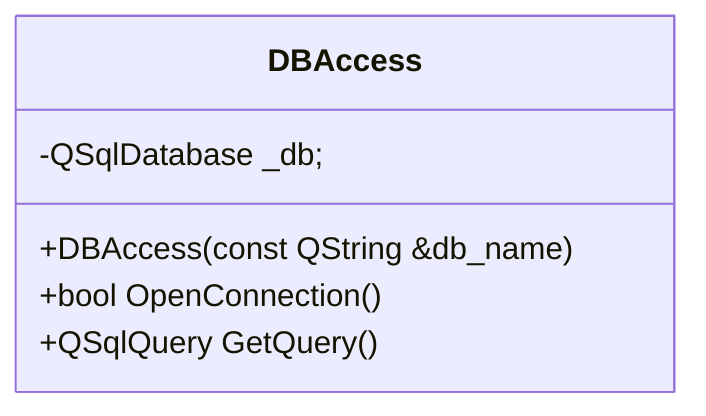

`GetQuery()`方法用于提供使用该数据库连接的`QSqlQuery`来进行`SQL`操作。
由于`QSqlDatabase`无法跨线程使用，每个需要访问数据库的组件都必须有一个连接（每个线程一个）。

#### 3.2.5. 管理组件

管理组件是执行具体事务的组件，在组件的基础上，它必须满足以下条件：

- 必须有一个名为`void Start()`的方法以无限循环从消息队列中取出任务。
- 必须连接至数据库以实现多线程并发的数据管理（假设数据库支持）。
- 由于此程序中消息为`JSON`字符串，需要相应的Parser对其进行解析。
- 同时需要Writer以构建响应`JSON`字符串。

定义为抽象类`AbstractManager`:

```c++
class AbstractManager : public AbstractComponent<JobQueue<RegPointer>>
{
public:
    AbstractManager(const QString &db_name) : _db(db_name), _dom() {}

    virtual void Start() = 0;

    JobQueue<RegPointer> *GetHandle() override
    {
        return &_jobs;
    }
protected:
    virtual bool Parse(const std::string &str) = 0;

    JobQueue<RegPointer> _jobs;
    DBAccess _db;
    rapidjson::Document _dom;
    rapidjson::Writer<rapidjson::StringBuffer> _writer;
};
```

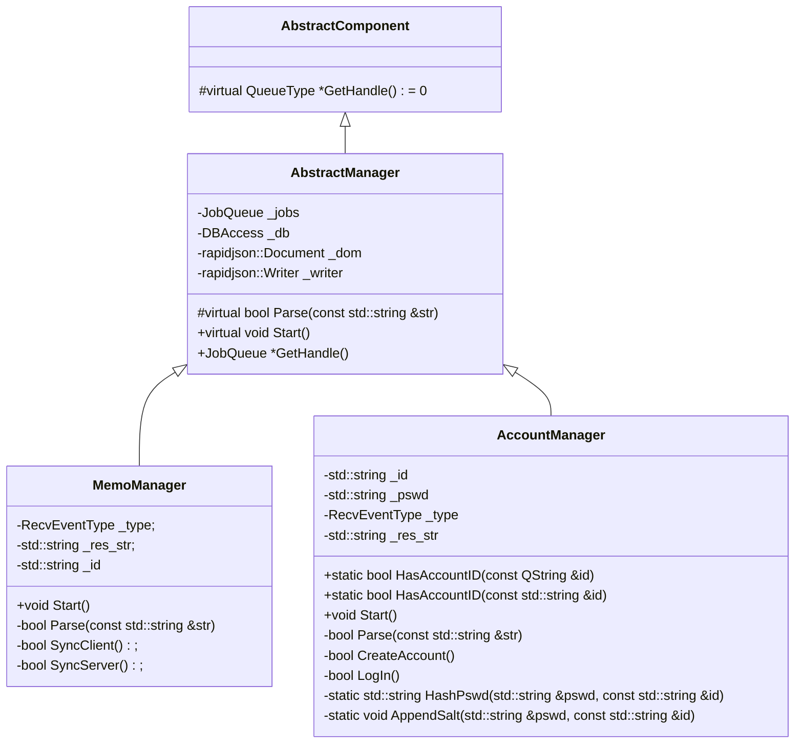

程序中使用`rapidjson`库对`JSON`字符串进行处理。

##### 3.2.5.1. 用户控制管理

定义如下：

```c++
class AccountManager : public AbstractManager
{
public:
    AccountManager(const QString &db_name) : AbstractManager(db_name) {}

    static bool HasAccountID(const QString &id);
    static bool HasAccountID(const std::string &id);

    void Start() override;
private:
    std::string _id;
    std::string _pswd;
    RecvEventType _type;
    std::string _res_str;

    bool Parse(const std::string &str) override;

    bool CreateAccount();
    bool LogIn();

    static std::string HashPswd(std::string &pswd, const std::string &id);
    static void AppendSalt(std::string &pswd, const std::string &id);
};
```

###### 3.2.5.1.1. 数据库表结构

管理组件需要连接至数据库并进行相应的查询、修改操作。基于程序功能定义如下的表：

```sql
CREATE TABLE IF NOT EXISTS accounts (
    id VARCHAR(36) NOT NULL,
    pswd VARCHAR(256) NOT NULL,
    PRIMARY KEY (id)
);
```

用于存放用户的ID以及密码。

###### 3.2.5.1.2. `Start`方法

此方法流程如下：

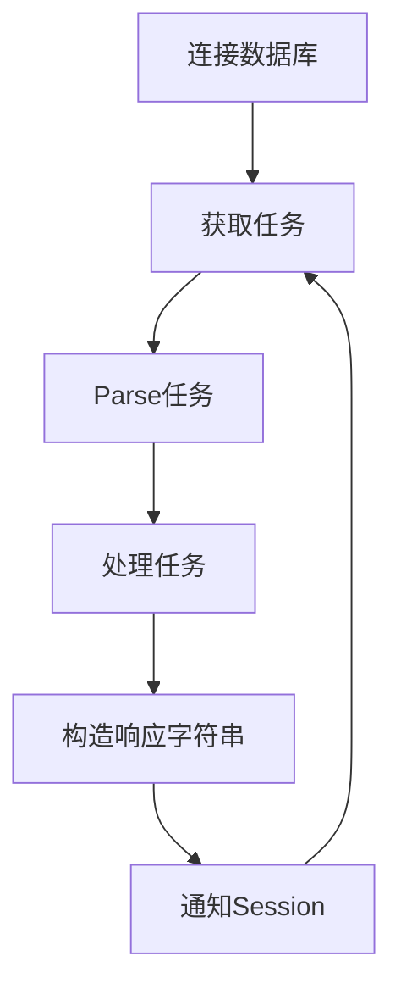

###### 3.2.5.1.3. 任务处理

下列几个方法用于任务的处理：

```c++
bool CreateAccount();
bool LogIn();
```

`CreateAccount`流程如下：

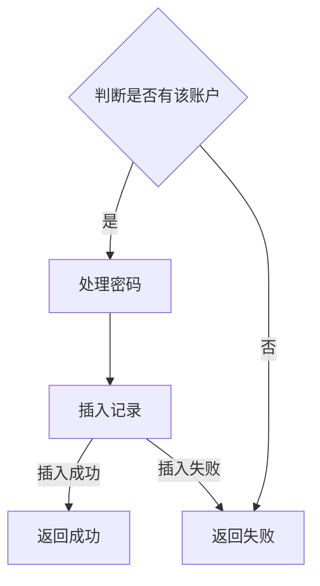

`LogIn`流程如下：

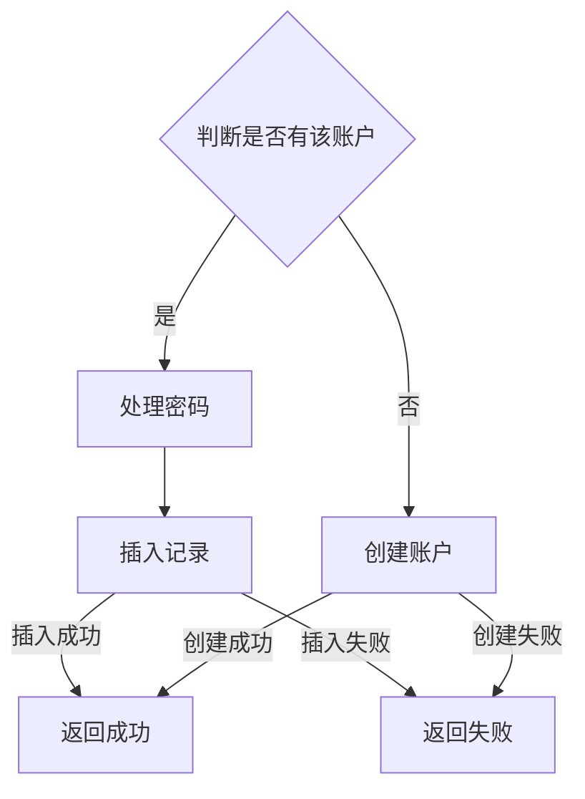

###### 3.2.5.1.4. 密码处理

密码不在服务器上明文存储，而是存储经过哈希后的密码。

$$
Hash(P) = SHA256(P | Base64(P))
$$

哈希函数使用`SHA256`为基础，盐为密码的`base64`字符串，以减少彩虹表碰撞。

##### 3.2.5.2. 备忘存储管理

与用户控制管理类似，不过需要增加额外的数据结构以构造相应字符串和向表中插入记录。

###### 3.2.5.2.1. 数据库表结构

与客户端类似，不过需要在表中与`accounts`表建立联系，从而支持多用户。

```sql
CREATE TABLE IF NOT EXISTS records(
    id VARCHAR(36) NOT NULL,
    record_id INT NOT NULL,
    due_date DATE,
    record_text VARCHAR(250) NOT NULL,
    is_done BOOLEAN NOT NULL,
    PRIMARY KEY (id, record_id),
    CONSTRAINT records_accounts_ref FOREIGN KEY (id) REFERENCES accounts (id) ON DELETE CASCADE
);
```

###### 3.2.5.2.2. 任务处理

以下方法提供任务处理功能:

```c++
bool SyncClient();
bool SyncServer();
```

其功能与客户端的相应功能对应。

`SyncClient`流程如下：

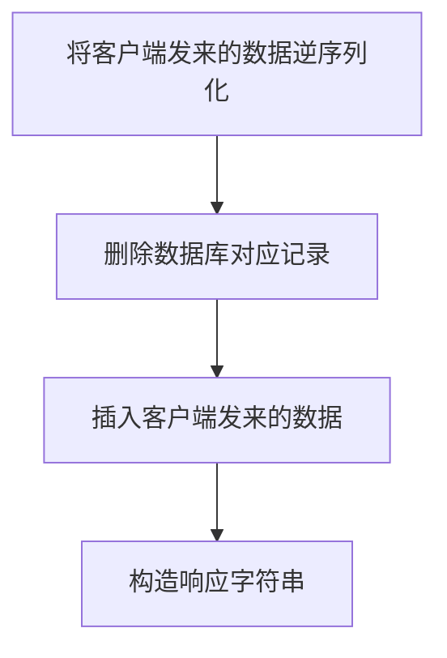

`SyncServer`流程如下：

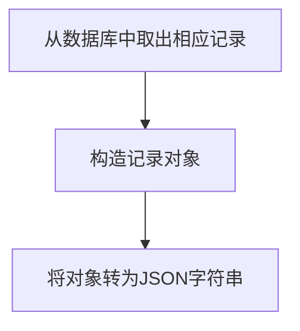

#### 3.2.6. 控制器

控制器负责网络部分与其他组件的沟通交流：

- 从网络部分获取以`base64`编码的`JSON`字符串并解码。
- 组件暴露自己的消息队列指针给它。
- 从解码后的字符串中获取任务信息。
- 根据任务信息分配任务。

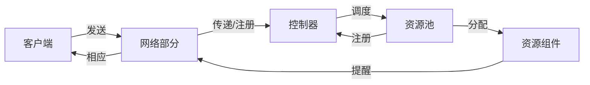

##### 3.2.6.1. 类设计

类设计如下：

```c++
class Controller
{
public:
    Controller() = default;

    RegPointer Register(const std::string &recv_str, std::size_t &reg_pos);

    void RegHandle(const ComponentType comp_type, JobQueue<RegPointer> *handle);

    bool Dispatch(RegPointer &regist_ptr);

    void Unregister(std::size_t reg_pos);
private:
    static constexpr int kQueueLen = 1024;
    std::pair<RegPointer, bool> _reg_queue[kQueueLen]; // true means the resource is being used
    int _queue_now = 0;
    std::mutex _queue_mtx;

    std::map<ComponentType, JobQueue<RegPointer> *> _handle_map;
};
```

私有成员：

- `static constexpr int kQueueLen = 1024;`：表示`_reg_queue`的长度。
- `std::pair<RegPointer, bool> _reg_queue[kQueueLen];`：供网络部分注册在控制器上，为其任务分配内存空间，`bool`表示此任务是否已完毕。
- `int _queue_now = 0;`：当前网络部分注册时会用到的`_reg_queue`的下标。
- `std::mutex _queue_mtx;`：控制对`_reg_queue`的访问。
- `std::map<ComponentType, JobQueue<RegPointer> *> _handle_map;`：供资源池注册在控制器上，以供其调度。

##### 3.2.6.2. 网络部分与控制器的交互

网络部分通过调用控制器的`Register`方法来注册（控制器分配空间）。

```c++
RegPointer Register(const std::string &recv_str, std::size_t &reg_pos)
{
    std::string json_str(base64_decode(recv_str));
    RegPointer res(new RegType(0, json_str));

    bool is_fin = false;
    std::lock_guard<std::mutex> lock(_queue_mtx);

    while (!is_fin)
    {
        if (!_reg_queue[_queue_now].second)
        {
            _reg_queue[_queue_now] = { res, true };
            reg_pos = _queue_now;

            is_fin = true;
        }
        _queue_now++;
        if (_queue_now >= kQueueLen)
            _queue_now = 0;
    }

    return res;
}
```

`RegPointer`使用智能指针自动管理其内存，定义如下：

```c++
using RegType = std::pair<Semaphore, std::string>;
using RegPointer = std::shared_ptr<RegType>;
```

每当网络组件调用`Register`，都会为其分配一个`RegPointer`，并在之后获取访问`_reg_queue`的锁，获取之后以轮询的方式寻找已完成的或者未分配的位置，将`RegPointer`放在该位置上并标记该位置的任务为未完成，之后返回该位置的值。

在注册完毕后，网络部分调用控制器的`Dispatch`方法，提供获得的`RegPointer`，让控制器为其任务进行调度：

```c++
bool Dispatch(RegPointer &regist_ptr)
{
    bool res = true;
    rapidjson::Document dom;
    dom.Parse(regist_ptr->second.c_str());

    if (dom.HasParseError() || !dom.IsObject() || !dom.HasMember(kEventGroupStr))
        res = false;
    else
    {
        std::string group_str(dom[kEventGroupStr].GetString());
        if (kEventGroupToCompType.count(group_str))
        {
            ComponentType type = kEventGroupToCompType.at(group_str);
            _handle_map.at(type)->Push(regist_ptr);
        }
        else
            res = false;
    }
    return res;
}
```

首先控制器解析`JSON`字符串，获取其中的任务信息，之后根据任务信息将任务分配给负责处理该任务的组件。在组件处理完任务并通知网络部分后，网络部分调用`Unregister`方法来标记任务已完成。

```c++
void Unregister(std::size_t reg_pos)
{
    _reg_queue[reg_pos].second = false;
}
```

流程如下：

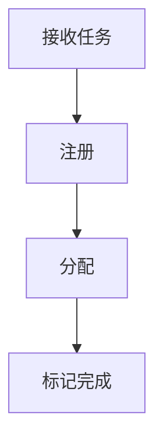

##### 3.2.6.3. 资源池与控制器的交互

资源池通过`RegHandle`将自己的消息队列指针暴露给控制器：

```c++
void RegHandle(const ComponentType comp_type, JobQueue<RegPointer> *handle)
{
    _handle_map[comp_type] = handle;
}
```

控制器将其处理的事务类型与其消息队列指针相关联，当有任务分配时即调用消息队列的`Push`方法将任务分配给资源池。

#### 3.2.7. 网络处理

网络处理负责服务端与客户端之间的沟通，程序使用`Boost.asio`来实现多线程的异步网络处理。

##### 3.2.7.1. `Server`类

定义如下：

```c++
class Server
{
public:
    Server(boost::asio::io_context &io_context, short port, Controller *ctrler)
        : _io_context(io_context),
          _acceptor(io_context, tcp::endpoint(tcp::v4(), port))
    {
        Accept(ctrler);
    }

private:

    void Accept(Controller * ctrler)
    {
        _acceptor.async_accept(
            [this, ctrler](const boost::system::error_code ec, tcp::socket socket)
            {
                if (!ec)
                {
                    std::make_shared<ServerSession>(std::move(socket), _io_context, ctrler)->Start();
                }

                Accept(ctrler);
            });
    }

    boost::asio::io_context &_io_context;
    tcp::acceptor _acceptor;
};
```

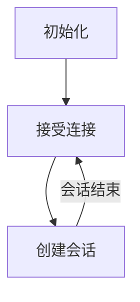

该类接受一个`io_context`作为上下文调度器，并且指定服务端监听的端口，传入控制器指针以供后续使用。
在`Server`初始化完毕后，`Server`调用`Accept`方法异步接受连接，接受连接后通过回调函数开始一个`Session`专门负责管理该连接，并重复调用`Accept`方法准备接受下一个连接。

##### 3.2.7.2. `Session`类

定义如下：

```c++
class ServerSession : public std::enable_shared_from_this<ServerSession>
{
public:
    ServerSession(tcp::socket socket, boost::asio::io_context &io_context, Controller *ctrler)
        : _strand(io_context),
          _socket(std::move(socket)),
          _ctrler(ctrler),
          _buf_vec(65500)
    {
    }

    void Start();
private:
    void ReadClientData();
    void Proceed(const std::size_t len);
    void Respond();

    tcp::socket _socket;
    std::vector<unsigned char> _buf_vec;
    std::string _buf;
    std::string _respond;
    boost::asio::io_context::strand _strand;
    Controller *_ctrler;
};
```

该类必须继承自`std::enable_shared_from_this<T>`，否则在类中引用自身会造成引用计数的增加，导致内存错误。

在`Session`类调用`Start`方法后，形成如下一条回调链：

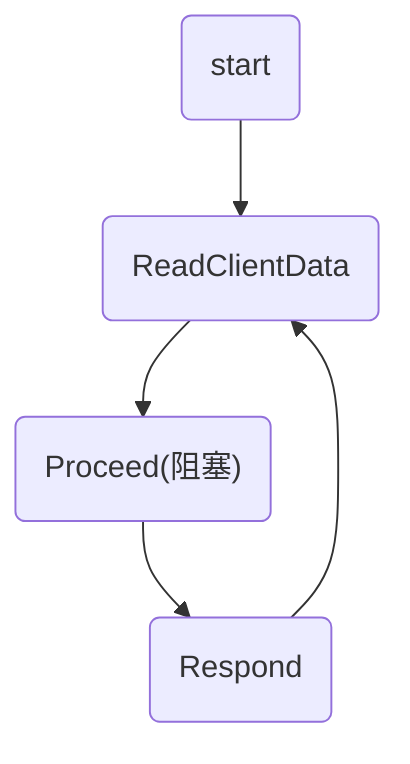

- `void Start()`：直接调用`ReadClientData`。
- `void ReadClientData()`：

    ```c++
    void ReadClientData()
    {
        _buf.clear();
        auto self(shared_from_this());
        _socket.async_receive(boost::asio::buffer(_buf_vec),
                              boost::asio::bind_executor(_strand,
                              [this, self](const boost::system::error_code ec, std::size_t byte_transfered)
                              {
                                  if (!ec)
                                  {
                                      for (int i = 0; i < byte_transfered; i++)
                                          _buf.push_back(_buf_vec[i]);
                                      Proceed(byte_transfered);
                                  }
                              }));
    }
    ```

    由于异步程序不在语句上阻塞，会直接结束方法，因此向`lambda`函数中传入指向自己的智能指针以保证在被调用时仍处于生命周期中。
    接受客户端传输的信息，在传输结束后调用`Proceed`。

- `void Proceed(const std::size_t len)`：

    ```c++
    void Proceed(const std::size_t len)
    {
        std::size_t reg_pos;
        RegPointer reg_ptr = _ctrler->Register(_buf, reg_pos);
        bool is_recv_str_valid = _ctrler->Dispatch(reg_ptr);
        if (is_recv_str_valid)
        {
            reg_ptr->first.Wait();
            _respond = reg_ptr->second;
        }
        else
        {
            static const char *invalid_json_query = "SU5WQUxJRCBKU09OIFFVRVJZLg=="; // base64 of "INVALID JSON QUERY"
            reg_ptr->second = invalid_json_query;
        }
        _ctrler->Unregister(reg_pos);

        _respond.swap(reg_ptr->second);

        Respond();
    }
    ```

    此方法为回调链中唯一的阻塞方法，在注册至控制器并请求调度之后即通过信号量来判断任务是否已完成，在任务完成前会一直阻塞在`reg_ptr->first.Wait()`，任务完成后令控制器标记任务已完成，随后调用`Respond`响应客户端。
- `void Respond()`：

    ```c++
    void Respond()
    {
        auto self(shared_from_this());
        boost::asio::async_write(_socket, boost::asio::buffer(_respond, _respond.length()),
                                 boost::asio::bind_executor(_strand,
                                 [this, self](const boost::system::error_code ec, std::size_t write_len)
                                 {
                                     if (!ec)
                                     {
                                         _socket.cancel();
                                         ReadClientData();
                                     }
                                 }));
    }
    ```

    将响应字符串发送给客户端，在发送完毕后调用`ReadClientData`继续接收客户端的下一个信息。

##### 3.2.7.3. 与客户端的交互格式

客户端发送至服务端：

- 登录：

    ```json
    {
        "EventGroup": "Account",
        "Event": "LogIn",
        "ID": "id",
        "Pswd": "pswd in b64",
    }
    ```

- 上传至服务端：

    ```json
    {
        "EventGroup": "Data",
        "Event": "SyncFromClient",
        "ID": "id",
        "Records": [
            {
                "RecID": int,
                "Text": "text",
                "DueDate": "time_str(XXXX-XX-XX)",
                "Done": bool
            }, ...
        ]
    }
    ```

- 与服务端同步：

    ```json
    {
        "EventGroup": "Data",
        "Event": "SyncFromServer",
        "ID": "id"
    ```

服务端发回至客户端：

- 登陆结果：

    ```json
    {
        "EventGroup": "Account",
        "Event": "Reply",
        "Result": bool
    }
    ```

- 同步结果：

    ```json
    {
        "EventGroup": "Data",
        "Event": "SyncReply",
        "SyncResult": bool,
    }
    ```

- 同步数据：

    ```json
    {
        "EventGroup": "Data",
        "Event": "SyncData",
        "ID": "id",
        "Records": [
            {
                "RecID": int,
                "Text": "text",
                "DueDate": "time_str(XXXX-XX-XX)",
                "Done": bool
            }, ...
        ]
    }
    ```

#### 3.2.8. 日志处理

日志类由静态方法构成，定义如下：

```c++
class Log
{
public:
    static void InitLog(const LogLevel max_log_level);
    static void SetOption(const LogOption option, const int value);
    static bool WriteLog(
                const LogLevel level,
                const std::string &log,
                const char *file_name,
                const char *func_name,
                int line);
    static void CloseLog();
};
```

- `static void InitLog(const LogLevel max_log_level)`：在写入日志前需调用该方法初始化日志，并提供日志显示的级别。
- `static void SetOption(const LogOption option, const int value)`：提供一些设置的选项，由使用者设置。
- `static bool WriteLog(const LogLevel level, const std::string &log, const char *file_name, const char *func_name, int line)`：写入日志，不直接调用。
- `static void CloseLog()`：刷新缓冲区并关闭日志。

日志共有四个级别

```c++
enum class LogLevel
{
    ERROR = 0,
    WARN,
    INFO,
    DEBUG
};
```

设定了打印的最高级别后，若写入日志的级别高于给定的最大日志级别，则不写入。

程序通过宏函数来调用`WriteLog`写入日志：

```c++
#define WRITE_LOG(level, msg) do{Log::WriteLog(level, msg, __FILE__ , __FUNCTION__ ,  __LINE__ );}while(0)
```

通过调用该宏可以实现打印源文件名称，函数以及行号的功能。

## 4. 程序编译

编译客户端所需依赖:

- `Qt(5.12)`

编译服务端所需依赖：

- `Boost(1.72)`
- `Qt(5.12)`
- `Qt MySql Driver(plugin)`
- `PicoSHA2`
- `rapidjson`
- `cpp-base64`

其中后三项已附在源码中，需要手动安装前三项。
