# 程序设计实践测试报告

---

## 1. `mini-client`程序

代码如下：

```c++
#include <boost/asio.hpp>
#include <boost/locale.hpp>
#include <string>
#include <vector>
#include <iostream>
#include <locale>
#include <codecvt>
#include <cstring>
#include <cstdlib>

#include "../include/cpp-base64/base64.h"
using namespace boost::asio;

static const char *kHost = "localhost";
static const char *kPort = "12345";

std::string ToUTF8(const std::string &gb2312)
{
    return boost::locale::conv::to_utf<char>(gb2312.c_str(), std::string("gb2312"));
}

int main()
{
    std::system("chcp 936");
    io_context ioc;
    try
    {
        ip::tcp::resolver resolver(ioc);
        auto ep = resolver.resolve(ip::tcp::v4(), kHost, kPort);

        ip::tcp::socket socket(ioc);

        connect(socket, ep);

        while (true)
        {
            std::string request;

            while (!request.size())
            {
                std::getline(std::cin, request);
            }

            std::cout << "raw: " << request << std::endl;
            std::cout << "UTF8" << request << std::endl;
            request = base64_encode(reinterpret_cast<const unsigned char *>(request.c_str()), request.size());
            std::cout << "b64: " << request << std::endl;
            write(socket, buffer(request, request.size()));

            std::vector<unsigned char> buf(10240);
            std::string reply;
            auto len = socket.read_some(buffer(buf));
            for (int i = 0; i < len; i++)
                reply.push_back(buf[i]);

            std::cout << "b64_reply: " << reply << std::endl;
            std::cout << "reply: " << base64_decode(reply) << std::endl;
        }
    }
    catch (const std::exception & e)
    {
        std::cerr << e.what() << std::endl;
    }
}
```

用于接受测试输入，并将输入发送到服务端，再将从服务端发回的响应打印至屏幕上。

下为测试所用的输入片段：

- 登录请求：

  - 请求1：

    测试正确的登录。

    ```json
    {"EventGroup": "Account","Event": "LogIn","ID": "test_id","Pswd": "test_pswd"}
    ```

    成功登陆账号。

    即

    ```json
    {
        "EventGroup": "Account",
        "Event": "LogIn",
        "ID": "test_id",
        "Pswd": "test_pswd"
    }
    ```

    预期结果：

    ```json
    {
        "EventGroup": "Account",
        "Event": "Reply",
        "Result": true
    }
    ```

    结果：

    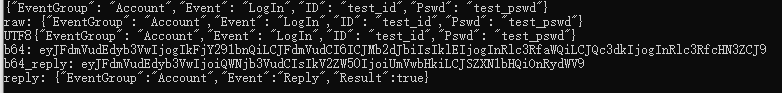

  - 请求2：

    测试密码错误时的登录。

    ```json
    {"EventGroup": "Account","Event": "LogIn","ID": "test_id","Pswd": "test_psw"}
    ```

    即

    ```json
    {
        "EventGroup": "Account",
        "Event": "LogIn",
        "ID": "test_id",
        "Pswd": "test_psw"
    }
    ```

    预期结果：

    密码错误，无法登录。

    ```json
    {
        "EventGroup": "Account",
        "Event": "Reply",
        "Result": false
    }
    ```

    结果：

    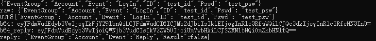

  - 请求3：

    测试注册账号。

    ```json
    {"EventGroup": "Account","Event": "LogIn","ID": "test_i","Pswd": "test_psw"}
    ```

    即

    ```json
    {
        "EventGroup": "Account",
        "Event": "LogIn",
        "ID": "test_id",
        "Pswd": "test_pswd"
    }
    ```

    预期结果:

    成功注册账号。

    ```json
    {
        "EventGroup": "Account",
        "Event": "Reply",
        "Result": true
    }
    ```

    结果：

    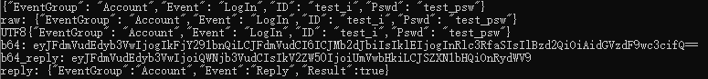

  - 请求4：

    测试`UTF-8`支持，重复两次，一次注册，一次登录。

    ```json
    {"EventGroup": "Account","Event": "LogIn","ID": "没有","Pswd": "ない"}
    ```

    即

    ```json
    {
        "EventGroup": "Account",
        "Event": "LogIn",
        "ID": "没有",
        "Pswd": "ない"
    }
    ```

    预期结果:

    成功注册和登录账号，两次均为成功。

    ```json
    {
        "EventGroup": "Account",
        "Event": "Reply",
        "Result": true
    }
    ```

    结果：

    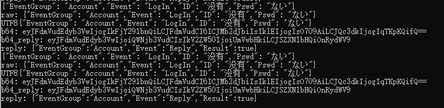

- 同步备忘至服务端：

  - 请求1：

    正常上传。

    ```json
    {"EventGroup": "Data","Event":"SyncFromClient","ID":"test_id","Records":[{"RecID":0,"Text":"12345","DueDate":"2017-09-12","Done":false},{"RecID":1,"Text":"54321","DueDate":"2017-09-13","Done":false},{"RecID":2,"Text":"kyomoiitenki","DueDate":"2123-09-12","Done":true}]}
    ```

    即

    ```json
    {
        "EventGroup": "Data",
        "Event":"SyncFromClient",
        "ID":"test_id",
        "Records":[
            {
                "RecID":0,
                "Text":"12345",
                "DueDate":"2017-09-12",
                "Done":false
            },
            {
                "RecID":1,
                "Text":"54321",
                "DueDate":"2017-09-13",
                "Done":false
            },
            {
                "RecID":2,
                "Text":"kyomoiitenki",
                "DueDate":"2123-09-12",
                "Done":true
            }
        ]
    }
    ```

    预期结果:

    成功。

    ```json
    {
        "EventGroup": "Data",
        "Event": "SyncReply",
        "SyncResult": true
    }
    ```

    结果：

    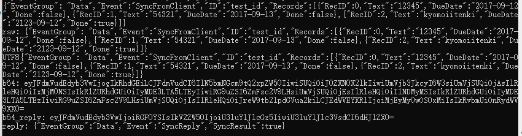

  - 请求2：

    在请求1的基础上改变id为不存在的id。

    ```json
    {"EventGroup": "Data","Event":"SyncFromClient","ID":"不存在的名称","Records":[{"RecID":0,"Text":"12345","DueDate":"2017-09-12","Done":false},{"RecID":1,"Text":"54321","DueDate":"2017-09-13","Done":false},{"RecID":2,"Text":"kyomoiitenki","DueDate":"2123-09-12","Done":true}]}
    ```

    预期结果:

    由于找不到该账户，返回失败。

    ```json
    {
        "EventGroup": "Data",
        "Event": "SyncReply",
        "SyncResult": false
    }
    ```

    结果：

    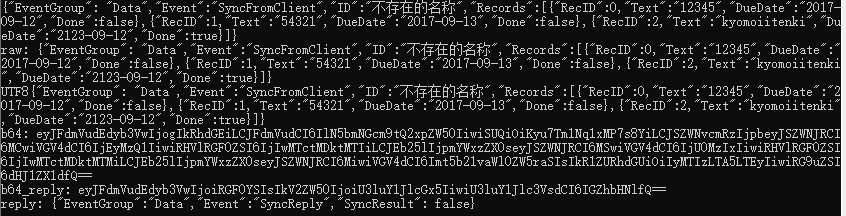

- 从服务端下载备忘请求

  - 请求1：

    正常请求，先执行上传请求中的请求1。

    ```json
    {"EventGroup":"Data","Event":"SyncFromServer","ID":"test_id"}
    ```

    即

    ```json
    {
        "EventGroup": "Data",
        "Event": "SyncFromServer",
        "ID": "test_id"
    }
    ```

    预期结果:

    返回正确的数据。

    ```json
    {
        "EventGroup":"Data",
        "Event":"SyncData",
        "ID":"test_id",
        "Records":[
            {
                "RecID":0,
                "Text":"12345",
                "DueDate":"2017-09-12",
                "Done":false
            },
            {
                "RecID":1,
                "Text":"54321",
                "DueDate":"2017-09-13",
                "Done":false
            },
            {
                "RecID":2,
                "Text":"kyomoiitenki",
                "DueDate":"2123-09-12",
                "Done":true
            }
        ]
    }
    ```

    结果：

    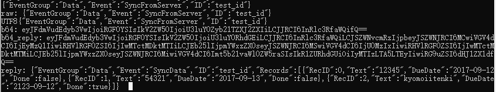

  - 请求2：

    改变ID为不存在于数据库中的ID。

    ```json
    {"EventGroup":"Data","Event":"SyncFromServer","ID":"不存在的ID"}
    ```

    即

    ```json
    {
        "EventGroup": "Data",
        "Event": "SyncFromServer",
        "ID": "test_id"
    }
    ```

    预期结果:

    返回失败。

    ```json
    {
        "EventGroup": "Data",
        "Event": "SyncReply",
        "SyncResult": false
    }
    ```

    结果：

    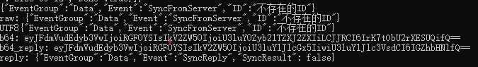

## 2. `presure-test`程序

用于构造随机请求，包括有效和无效的请求，以及随机数据，并将构造的请求以多线程并行的方式发送至服务端。

运行截图：

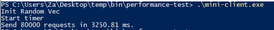

同时将服务端调试级别改为`WARN`：

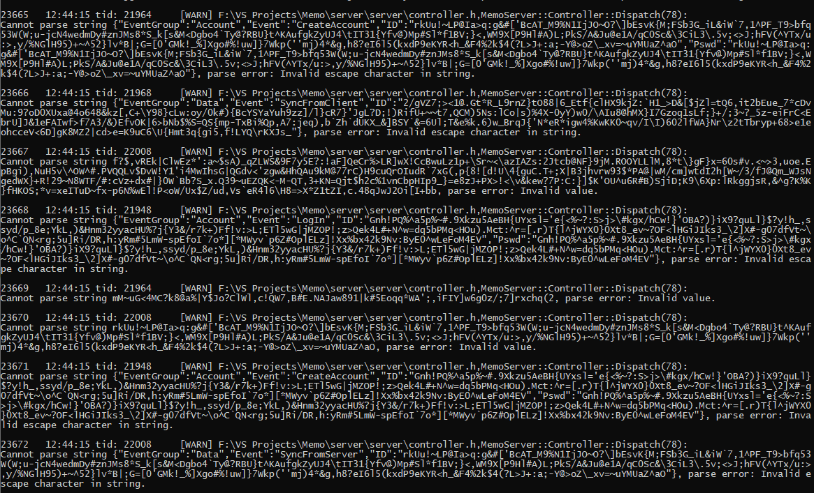

程序打印出大量的警告信息。

同时我们利用该程序探测是否有内存泄漏。

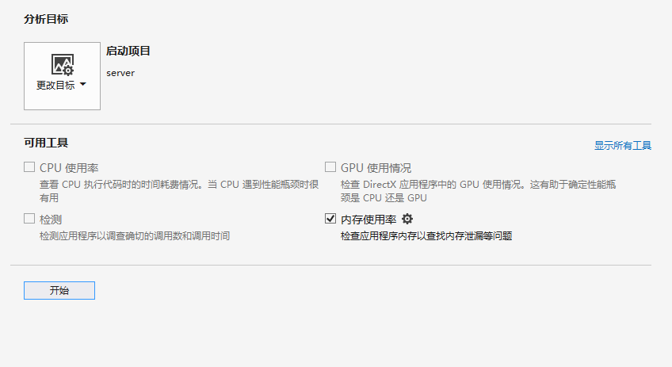

连续多次运行程序：

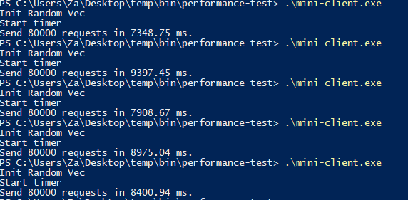

内存变化：

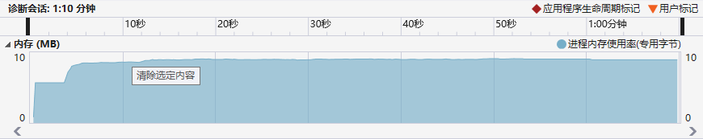

内存所属：

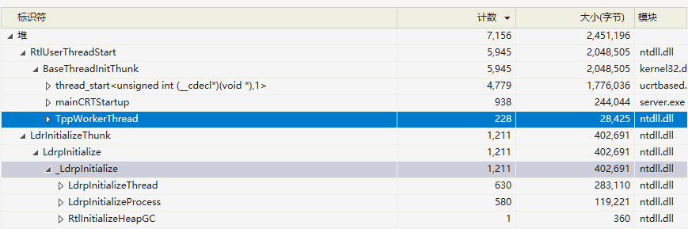

没有泄露在堆中的内存。
